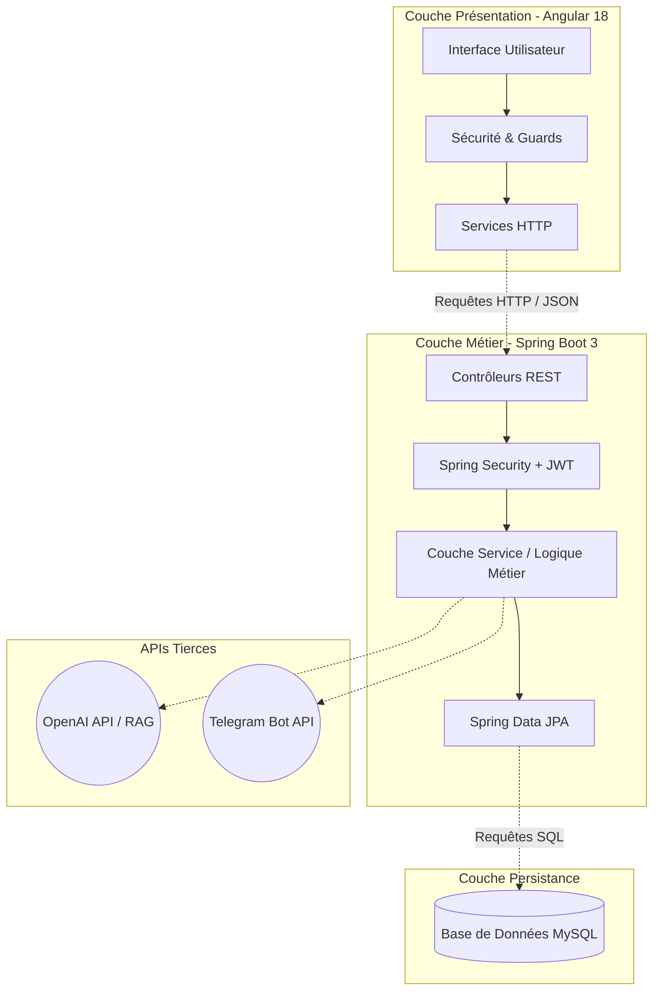
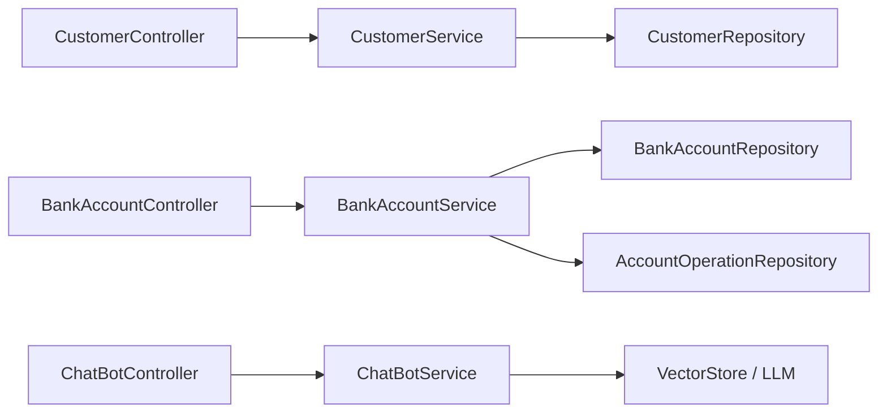

# 🏦 Projet Digital Banking - Spring Boot & Angular

Un système de gestion bancaire digital complet et moderne, intégrant un Backend robuste, une interface Frontend dynamique, ainsi que des fonctionnalités avancées d'Intelligence Artificielle (Chatbot RAG) et de notifications via Telegram.

---

## 👨‍🎓 Auteurs & Encadrement

Ce projet a été réalisé dans un cadre académique.

- **Réalisé par :** Marouane Mounir (Filière : BDCC-II)
- **Encadré par :** Prof. Mohamed YOUSSFI

---

## 📖 Présentation du Projet

Le projet **Digital Banking** a pour objectif de simuler les opérations courantes d'une banque moderne. Il permet de gérer des clients, leurs comptes bancaires (comptes courants et comptes épargne) ainsi que les différentes opérations financières associées (versements, retraits, virements). 

En plus des fonctionnalités bancaires standards, cette plateforme se distingue par :
- Une **sécurité renforcée** basée sur les tokens JWT et une gestion précise des rôles (Admin, Utilisateur).
- L'intégration d'un **Chatbot IA basé sur l'architecture RAG** (Retrieval-Augmented Generation) pour répondre intelligemment aux questions des utilisateurs.
- Une intégration avec un **Bot Telegram** pour des notifications ou requêtes instantanées.

---

## 🏗 Architecture du Projet

L'application repose sur une architecture multi-tiers (Frontend, Backend, Base de données).

### 1. Architecture Technique Globale



### 2. Diagramme de Composants Backend



---

## 💻 Technologies Utilisées

### ⚙️ Backend (Serveur)
- **Langage :** Java 21
- **Framework :** Spring Boot 3.x
- **Accès aux données :** Spring Data JPA / Hibernate
- **Sécurité :** Spring Security avec authentification **JWT** (JSON Web Token)
- **Documentation API :** Swagger / OpenAPI 3

### 🎨 Frontend (Client)
- **Framework :** Angular 18+
- **Langage :** TypeScript
- **Style :** Bootstrap / Angular Material
- **Graphiques :** Chart.js (pour le tableau de bord)

### 🗄️ Base de Données & Déploiement
- **SGBD :** MySQL 8.0
- **Conteneurisation :** Docker & Docker Compose

### 🤖 IA & Intégrations
- **Modèles de Langage :** OpenAI API
- **Technique IA :** RAG (Retrieval-Augmented Generation) pour le contexte documentaire
- **Messagerie :** Telegram Bot API

---

## ✨ Fonctionnalités Principales

1. **Gestion des Clients :**
   - Création, modification, suppression et recherche de clients.
2. **Gestion des Comptes Bancaires :**
   - Support des comptes courants (avec découvert) et épargnes (avec taux d'intérêt).
   - Consultation de l'historique des opérations avec pagination.
3. **Opérations Financières :**
   - Réalisation de débits, crédits et virements inter-comptes avec gestion de la traçabilité.
4. **Tableau de Bord (Dashboard) :**
   - Affichage des statistiques globales (nombre de comptes, balance totale, etc.).
   - Visualisation graphique des données.
5. **Chatbot IA & Support :**
   - Assistant virtuel intelligent pour guider les utilisateurs.
   - Intégration Telegram pour recevoir des informations via mobile.

---

## 🚀 Guide d'Installation et d'Exécution

### Prérequis
- Avoir installé Docker et Docker Compose sur votre machine.

### Étapes de lancement

1. **Cloner le projet**
   ```bash
   git clone https://github.com/Marouanemounir/Projet-Spring-Angular-JWT-Digital-Bankin.git
   cd Projet-Spring-Angular-JWT-Digital-Bankin
   ```

2. **Configuration de l'environnement**
   Vérifiez que le fichier `.env` est bien configuré (si vous utilisez des clés API externes comme OpenAI ou Telegram).

3. **Lancer les conteneurs (Base de données, Backend, Frontend)**
   Exécutez la commande suivante à la racine du projet :
   ```bash
   docker compose up -d --build
   ```

4. **Accéder à l'application**
   - **Frontend (Application Web) :** [http://localhost:4200](http://localhost:4200)
   - **Backend API :** [http://localhost:8085](http://localhost:8085)
   - **Documentation API (Swagger) :** [http://localhost:8085/swagger-ui/index.html](http://localhost:8085/swagger-ui/index.html)

Pour arrêter les services :
```bash
docker compose down
```

---

*Projet développé avec passion dans le cadre de la formation BDCC-II.*
